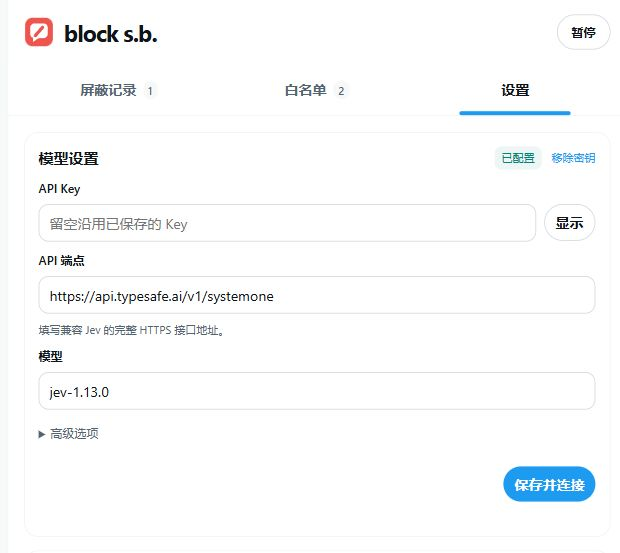
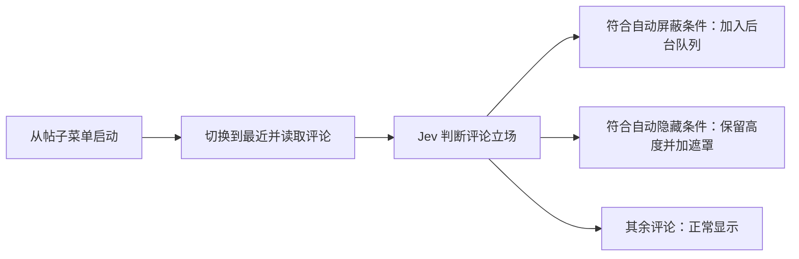
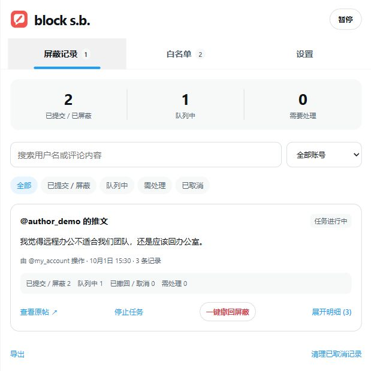
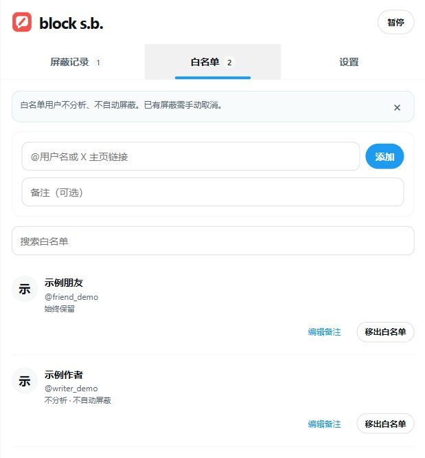

<p align="center">
  
</p>

# block somebody · block s.b.

Block somebody 简称 block s.b. 是一款面向Chrome浏览器打造的针对改善X的浏览体验的插件，能够快速地帮助你屏蔽某一个评论区中所有你不喜欢的内容。

有时你想屏蔽一位博主，也不想再看到评论区里赞同同一观点的人。逐个打开菜单、确认屏蔽，做起来很重复。block s.b. 把这些操作集中到一个入口：你选择原帖，插件读取评论，由 Jev 判断评论与原帖的立场关系，再按你设置的阈值处理。

插件只在你主动开启的评论区工作。平时浏览 X 时，不会自动扫描首页，也不会一直在页面上显示概率和垃圾桶。它会实际修改 X 的屏蔽关系，因此也提供了屏蔽记录、整组撤回和白名单，方便你检查结果和改主意。

目前支持桌面 Chrome 和 X / Twitter 网页。界面支持简体中文、繁体中文（台湾用语）、日语、韩语和英语，跟随 Chrome 的界面语言；其他语言回退为英语。项目使用原生 JavaScript，基于 Chrome Manifest V3，无运行时依赖。

## 安装

目前可以通过 Chrome 的「加载已解压的扩展程序」安装。

1. 从 [Releases](https://github.com/cnflwzh/block_somebody_plugin/releases/latest) 下载 `block-sb-版本号.zip` 并解压到固定目录；也可以下载仓库源码或用 Git 克隆到本地。
2. 打开 `chrome://extensions`，开启右上角的「开发者模式」。
3. 点击「加载已解压的扩展程序」，选择解压后包含 `manifest.json` 的目录。
4. 在浏览器扩展菜单里固定 block s.b.，然后刷新已经打开的 X 页面。

加载源码无需 Node.js 或构建。也可以使用 Node.js 20+ 执行 `npm run build` 后加载 `dist/`，无需安装依赖。不要选择 `src/`。更新后点击扩展管理页的重新加载按钮并刷新 X 页面；如果使用的是 `dist/`，先重新构建。沿用原来的加载目录，保留已有的扩展数据。

## 第一次使用

### 连接 Jev

点击浏览器工具栏中的图标，进入「设置」。顶部的「模型设置」集中放置 API Key、接口地址和模型。

<p align="center">
  
</p>

*模型设置截图为旧版布局，自定义 Prompt 现已改为独立编辑页。*

使用官方 Jev 服务时，填写自己的 API Key，保留默认端点 `https://api.typesafe.ai/v1/systemone` 和模型 `jev-1.13.0`，然后点击「保存并连接」。插件会用固定的示例文本检查连接，成功后才保存配置。这一步和后续评论分析都会调用模型服务，可能产生用量费用。

你也可以使用自己的代理端点和模型名称。端点需要是完整的 HTTPS 地址，并兼容 [Jev systemone 的请求与响应格式](https://docs.typesafe.ai/api)，不能直接填写其他协议的聊天接口。首次使用自定义域名时，Chrome 会请求该域名的访问权限。更换域名需要重新输入对应的 Key；沿用同一域名时，Key 留空即可使用已经保存的值。

### 选择要处理的原帖

在 X 帖子右上角打开菜单，选择原生屏蔽选项下面的 **「屏蔽 @用户名 及其评论区的支持者」**。

插件会进入这条帖子的详情页，通过页面上的排序菜单切换到「最近」。等首批评论加载并确认就绪后，原帖作者进入屏蔽队列，评论分析随即开始。点击入口前已经加载的回复也会被扫描，不需要重新滚动一遍。



### 看懂处理结果

启用后，评论日期旁会显示「附和概率」和「加入屏蔽」。你可以查看模型判断，也可以直接手动屏蔽某位评论者。

把鼠标移到概率上，会展开各选项的概率面板。不同选项使用不同颜色的 0～100% 进度条，勾选的屏蔽项还会标出当前屏蔽阈值刻度；面板同时显示模型置信度。旧结果没有保存的概率显示为「—」，悬停不会额外请求模型。

| 评论的情况 | 页面和账号会怎样处理 |
| --- | --- |
| 模型判定支持原帖，且支持概率、置信度都达到阈值 | 账号加入后台屏蔽队列，评论开始播放移除动画 |
| 判定为支持，但概率落在自动隐藏区间 | 评论覆盖遮罩，原来的高度保留；点击「查看原文」仍能阅读 |
| 反对、无关、立场不明，或没有满足处理条件 | 保留原文 |
| 白名单用户 | 不分析，也不自动屏蔽 |

默认「谨慎」策略的自动屏蔽条件是支持概率至少 **92%**、模型置信度至少 **80%**。自动隐藏默认从 **80%** 开始，到自动屏蔽概率阈值为止。达到屏蔽概率、但置信度不足的评论会正常保留。

这些数字是筛选偏好，不是准确率承诺。模型可能误解反讽、玩笑或省略的上下文，第一次使用时可以先检查几条结果，再决定是否调整策略。

## 日常使用

### 自动加载和后台处理

你可以自己往下滚动，也可以在页面右下角的任务栏打开「自动加载」。自动加载会分段向下滚动，等待当前评论分析完再继续，并尝试展开 X 提供的「可能的垃圾信息」。它默认关闭。

离开原帖、切到其他标签页或打开管理面板时，自动滚动会暂停。**已经判定并入队的屏蔽仍会在后台逐个提交**，不需要你一直守着原帖。浏览器完全退出后，后台才会停止运行；下次启动会恢复尚未提交的任务。

「离开页面」和「结束任务」有区别：离开页面只停止该页新增分析；点击「结束」还会取消该任务尚未提交的自动屏蔽。已发出的请求不能靠结束任务撤回，需要到屏蔽记录中取消屏蔽。

### 屏蔽记录和撤回

点击垃圾桶或浏览器工具栏图标，可以打开管理面板。屏蔽记录按原帖分组，并区分执行操作的 X 账号。展开明细后，可以查看触发评论、判定结果和操作状态。

<p align="center">
  
</p>

如果误处理了整条评论区，可以点击 **「一键撤回屏蔽」**。插件会停止该原帖的分析、取消尚未提交的屏蔽，并把本任务可撤销的账号加入取消队列。也可以在明细中单独取消某一个账号的屏蔽。

取消屏蔽时，需要保持相同登录账号的任意 X 页面打开，不必停留在原帖。撤销会保留记录，被撤销的账号也不会在当前任务中再次自动屏蔽。

记录中的「已提交」表示 X 返回了 HTTP 成功响应，插件没有再额外查询屏蔽关系。另外，普通屏蔽不会预先检查你是否已经屏蔽过这个人，所以撤销可能解除你此前已有的屏蔽。确认整组撤回前，请看一下账号明细。

### 白名单

对白名单中的用户，插件不会发送其内容给 Jev，也不会自动屏蔽。可以在管理面板中输入 `@用户名` 或 X 个人主页链接添加，并写一条备注。

<p align="center">
  
</p>

加入白名单会取消尚未提交的相关屏蔽任务，但不会自动解除已经建立的屏蔽关系。如果对方已经被屏蔽，需要到记录中再取消一次。

### 调整策略、Prompt 和动画

识别策略提供「谨慎」「平衡」「积极」和自定义阈值。支持概率表达评论属于支持立场的程度，模型置信度是另一个条件；只看到很高的支持概率，并不代表一定会自动屏蔽。

点击「模型设置 → 自定义 Prompt」会打开独立的分析规则编辑页。可视化模式从上到下分别编辑输入内容、提示词和输出选项，也可以切到 Raw 编辑同一份 JSON 配置。Raw 校验失败时会保留原文，不覆盖已保存的规则。

输入内容和提示词都支持变量；点击文本框下方的变量按钮即可插入：

| 变量 | 代入内容 |
| --- | --- |
| `{{original_post}}` | 所选原帖正文 |
| `{{reply}}` | 当前待判断评论正文 |
| `{{parent_reply}}` | 直接父评论正文；直接回复原帖时为空 |
| `{{reply_is_direct}}` | 是否直接回复原帖，`true` 或 `false` |
| `{{unseen_media}}` | 上下文是否含未读取媒体 |
| `{{incomplete_text}}` | 上下文文本是否不完整 |

每个输出选项包含名称、判断标准和「命中后屏蔽」开关。选项可新增、删除、调整顺序；内部标识自动生成，也可展开修改。允许勾选多个屏蔽选项，但**概率不相加**：模型选中的类别必须在勾选项中，该类别的概率和模型置信度还要分别达到设置页阈值。例如阈值为 88%，两个屏蔽类别分别为 50% 和 40%，不会按 90% 屏蔽。

自定义规则下，页面显示「命中概率」，取勾选类别中的最高单项概率。模型选中未勾选的类别时，不会自动屏蔽或遮罩。规则默认仍然识别支持、反对、无关和无法判断；原有的自定义提示词会保留在编辑器中。

「预览请求」使用可编辑的示例文本展开变量，展示实际请求内容，不调用 API。「保存规则」只做本地校验；API 端点、模型和 Key 仍在模型设置中通过「保存并连接」配置。恢复默认先修改当前草稿，保存后才生效。

更换端点、模型或分析规则后，当前任务的旧分析结果会清除，旧配置下尚未完成的分析会取消；已有屏蔽记录和已入队操作保留。历史明细保留当时命中类别的名称和判断标准。相同请求与评论上下文可以继续复用有效缓存；仅修改「命中后屏蔽」开关时，已有分类缓存仍可复用，并按新规则重新判断。缓存默认最多 10000 条，保存满 30 天后过期。

在「页面体验」里，可以选择飞入垃圾桶或粒子消散，也可以关闭动画。动画从确定屏蔽并入队时开始，不等待 X 请求结束：先让评论消失、保留空位，再平滑补齐下方内容。普通的自动隐藏只加遮罩，不改变评论高度。

## 数据与使用范围

插件使用浏览器现有的 X 登录状态执行屏蔽，不需要你提供 X 密码或 X 开发者 API Key。

- **发送给模型服务的内容**：原帖、当前评论和必要的父评论文本，以及判断所需的上下文标记。使用自定义端点时，这些内容和 API Key 会发送到你配置的服务。
- **保留在浏览器本地的内容**：设置、API Key、白名单、屏蔽记录及任务数据。导出记录不包含 API Key，但包含账号和操作记录，分享前请自行检查。
- **分类缓存**：只保存请求摘要和分类结果，不保存密钥或推文原文。X 登录 Cookie 不发送给模型服务。
- **评论上下文**：任务启用后，已读取的评论文字和父子关系会单独保存在扩展本地，按登录账号和原帖隔离，最多 3000 条，30 天未更新自动过期。中间回复被隐藏或屏蔽后，后续评论仍可使用这份上下文；刷新后也能补回已保存的父评论。它不包含登录凭据，不进入导出文件；白名单内容不会作为上下文发送给模型。未曾读取且 X 不再提供的父评论无法恢复，这类回复暂不分析。

插件额外隐藏评论的范围只限对应的原帖评论区，不会在个人主页或无关帖子里继续隐藏同一用户。X 自身的屏蔽关系会影响哪些内容能看到，这部分仍由平台决定。

目前按文本判断，不读取图片或视频中的观点。自动加载也只能处理 X 实际返回的回复，不能保证拿到全部评论。每次任务最多分析 2000 条；页面长时间没有新数据时会停止自动加载，不把这种情况当作已经读完。

X 的网页结构、排序和内部接口可能变化。插件不是 X 官方工具，遇到请求失败或限制时，会记录错误或暂停队列，不会把失败操作当成成功。历史记录达到 5000 条后会停止新增操作，浏览器存储配额也可能更早成为限制。

## 本地开发

开发检查和构建使用 **Node.js 20+**。扩展没有运行时依赖；运行核心测试前执行 `npm ci`，安装仅用于模拟 IndexedDB 的开发依赖。直接加载扩展、语法检查和构建均不需要安装依赖。

### 目录结构

```text
blocksb/
├── manifest.json          # 扩展入口、权限和资源声明
├── _locales/              # Chrome 原生语言文件，直接维护并提交
├── src/
│   ├── background.js      # 分析调度、消息处理和后台队列
│   ├── content/           # X 页面适配、DOM 操作和动画
│   ├── manager/           # 弹出面板、记录、白名单和设置
│   └── lib/               # 判定规则、存储、模型请求和缓存
├── assets/                # 图标等发布资源
├── docs/
│   ├── images/            # README 界面截图
│   └── design/            # 设计资料；早期原型仅供参考
├── scripts/               # 静态检查、构建和发布清单
├── tests/                 # 核心功能测试
├── AGENTS.md              # 代码代理的仓库协作约定
├── dist/                  # 构建产物，不提交
└── .local/                # 本机调试资料，不提交
```

### 常用命令

```sh
npm run check   # 检查语法、模块和资源引用，以及部分密钥格式
npm test        # 运行使用本地模拟数据的核心测试
npm run build   # 生成可加载的 dist 目录
```

开发时可以直接在 Chrome 加载项目根目录；使用 `dist/` 时需先构建，修改后也需重新构建。修改完成后，集中执行需要的检查，再重新加载扩展并刷新 X 页面。扩展后台日志可从 `chrome://extensions` 的 Service Worker 入口查看；页面脚本的问题则查看 X 页面的开发者工具。

构建按 [scripts/extension-files.mjs](scripts/extension-files.mjs) 中的清单复制文件，源码与 `dist` 保持相同的相对路径。新增或移动资源时，要同步调整清单、Manifest 和相关引用。不要直接修改 `dist`，也不要把整个工作目录压缩成发布包。

### 语言文件

直接维护 Chrome 原生的 `_locales/<语言代码>/messages.json`：`en` 为英语，`zh_CN` 为简体中文，`zh_TW` 为繁体中文，`ja` 为日语，`ko` 为韩语。这些文件属于源码，需要提交；不经过自定义转换。条目使用 Chrome 标准格式：

```json
{
  "save_settings": {
    "message": "保存设置"
  }
}
```

代码中的 `t("save_settings")` 封装了 `chrome.i18n.getMessage()`。动态内容使用 Chrome 的命名占位符，例如 `"message": "已处理 $v0$ 条"`，配合 `"placeholders": { "v0": { "content": "$1" } }`；调用 `t(key, count)` 时传入替换值，各语言可调整占位符的位置。Manifest 使用 `__MSG_消息键__`，默认语言由 `default_locale` 指定为英语。

`npm run check` 检查语言文件的消息键、占位符和资源引用；`npm run build` 将原生文件直接复制到 `dist/`。新增语言时添加对应的 `_locales/<语言代码>/messages.json`，并将路径加入 [scripts/extension-files.mjs](scripts/extension-files.mjs) 的发布清单。

界面语言不会改写用户的 Prompt、自定义输出选项或推文原文，也不会因语言切换改变分类请求。既有历史中的原始规则与错误记录保留生成时的内容。

### 工作流程

页面脚本扫描已经加载的评论 DOM，再从 X 后续响应中补充数据。后台核对评论所属原帖和父评论关系，检查白名单，查询缓存，然后调用模型。有效结果按当前策略决定是否入队。

屏蔽队列串行提交，每次请求完成后至少间隔 2.5 秒。它会核对当前登录账号，避免切换账号后把旧任务提交到另一个账号。请求失败或结果未知时不会自动重复发送。

修改分析逻辑时，需要同时考虑白名单、账号隔离、缓存失效和旧请求返回的情况。页面动画、模型分析和实际提交是三个不同阶段，不应互相阻塞。更多协作与验证约定见 [AGENTS.md](AGENTS.md)。

### 预览动画

打开 X 评论区后，可以在开发者工具 Console 的默认页面上下文中输入：

```js
blockSBDebug.enable("fly")       // 预览飞入垃圾桶
blockSBDebug.play()              // 播放第一条可见评论的动画
blockSBDebug.play("评论链接或ID") // 目标评论需要已加载
blockSBDebug.reset()             // 恢复预览移除的评论

blockSBDebug.enable("particles") // 切换为粒子消散
blockSBDebug.play()
blockSBDebug.disable()           // 恢复评论并退出预览
```

预览本身不会调用 Jev 或创建屏蔽任务，但开启前已经发起的分析和后台操作不会因此取消。需要完全停下任务时，先暂停队列，再做动画调试。

### 提交改动

业务修改尽量保持范围清楚。涉及核心规则时，用模拟数据覆盖关键行为；不要用真实账号操作来代替可重复的本地验证。报告问题时，说明扩展版本、复现步骤和预期结果即可；附带截图或日志前，去掉密钥、Cookie 和私人记录。

`.local/`、浏览器调试目录、日志及构建产物已通过 `.gitignore` 排除。提交前仍需检查文件列表，尤其不要把个人导出记录或带登录信息的完整请求加入仓库。

## 参考与许可

模型接口见 [TypeSafe API 文档](https://docs.typesafe.ai/api)。X 网页接口的实现参考了 [make-x-great-again 的接口研究](https://github.com/foru17/make-x-great-again/blob/main/extension/lib/x-action.ts)。

本项目采用 **GNU Affero General Public License v3.0（AGPL-3.0-only）**，完整文本见 [LICENSE](LICENSE)。
